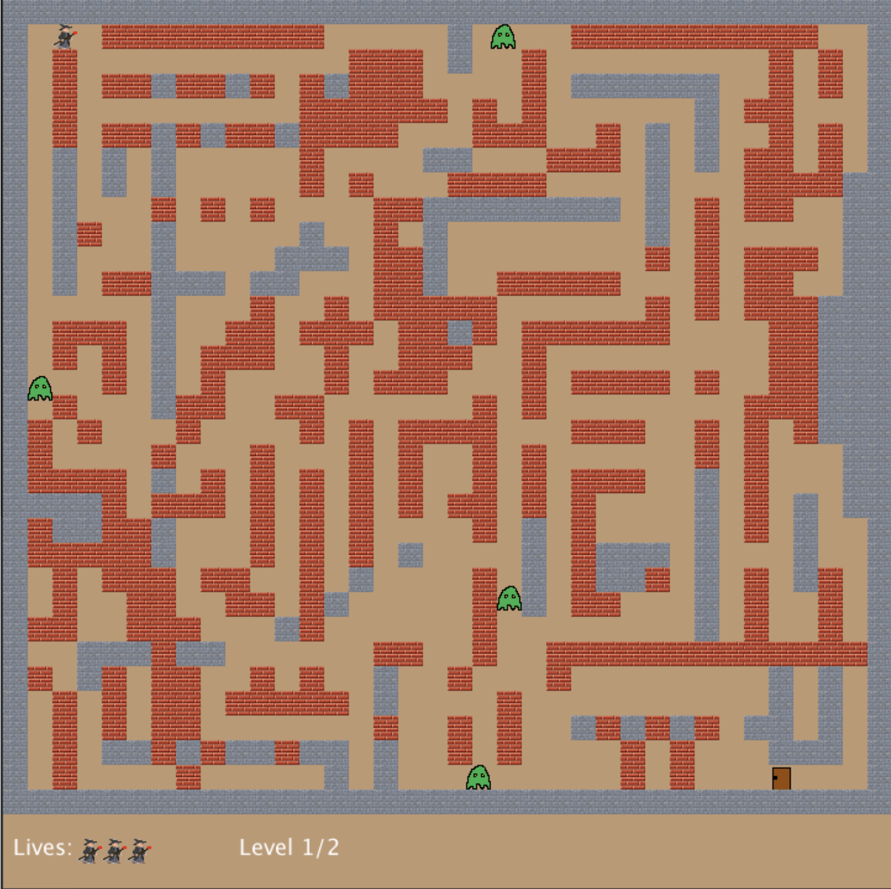

# Gremlins Game

Gremlins is a maze-based game where a wizard navigates through a maze filled with dangerous gremlins. The goal is for the wizard to reach the exit while avoiding or defeating the gremlins.

## Features

- **Wizard Character**: Play as a wizard who can shoot magical spells to defeat gremlins.
- **Gremlins**: Enemies scattered throughout the maze that can kill the wizard.
- **Exit**: The wizard must find the exit to complete the level.

## Requirements

- Java 8
- Gradle

## Installation

1. Clone the repository:

   ```
   git clone https://github.com/Fahim-ctrl-oss/MyProjects.git
   ```

2. Navigate to the project directory:

   ```
   cd gremlins_v1.1
   cd gremlins
   ```

3. Build the project using Gradle:

   ```
   gradle build
   ```

## Usage

1. Run the game using Gradle:

   ```
   gradle run
   ```

2. To play the game:
   - Use arrow keys to move the wizard.
   - Use the spacebar to shoot spells.
   - Navigate through the maze, defeat gremlins, and find the exit.

3. Enjoy playing Gremlins!

## Controls

- **Movement**: Arrow keys (Up, Down, Left, Right), WASD, R
- **Shoot**: Spacebar

## Screenshots



## Credits

- This project was created as part of an assignment for The University of Sydney.
- All resources and assets used in this project were provided by The University of Sydney.
